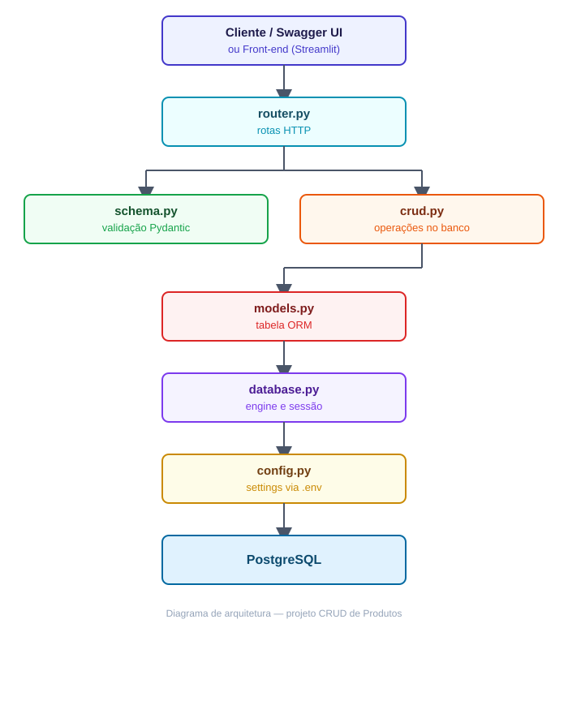

# CRUD de Produtos com FastAPI, PostgreSQL e Docker

API REST para cadastro e gerenciamento de produtos, construída durante o treinamento **Jornada de Dados**. O projeto implementa as quatro operações básicas de um CRUD (Create, Read, Update e Delete) sobre uma tabela no PostgreSQL, com validação de dados, documentação automática, configuração via variáveis de ambiente, front-end em Streamlit e ambiente totalmente containerizado.


## O que o projeto faz

- Cadastra, lista, busca por ID, atualiza e remove produtos.
- Valida os dados de entrada e saída com **Pydantic** (e-mail do fornecedor válido, valor maior que zero, campos obrigatórios).
- Persiste os dados em **PostgreSQL** usando o **SQLAlchemy ORM**.
- Cria a tabela automaticamente na inicialização da aplicação.
- Lê a configuração de conexão (host, porta, banco, usuário, senha) a partir de variáveis de ambiente, com validação via `pydantic-settings`.
- Gera documentação interativa (Swagger UI) sem configuração extra.
- Sobe banco, backend e front-end com um único comando via **Docker Compose**.
- Possui um front-end em **Streamlit** que consome a API.

## Stack

| Camada              | Tecnologia                                                   |
|---------------------|--------------------------------------------------------------|
| Linguagem           | Python 3.12                                                  |
| Framework web       | FastAPI                                                      |
| Servidor ASGI       | Uvicorn                                                      |
| Front-end           | Streamlit, Pandas e Requests                                 |
| Validação e schemas | Pydantic v2 (`EmailStr`, `Field`, `Annotated`)               |
| Configuração        | `pydantic-settings` + `python-dotenv` (variáveis via `.env`) |
| ORM                 | SQLAlchemy 2.x                                               |
| Banco de dados      | PostgreSQL 16                                                |
| Driver              | psycopg2-binary                                              |
| Containers          | Docker e Docker Compose                                      |
| Dependências        | Poetry (`pyproject.toml`, `poetry.toml`, `poetry.lock`)      |
| Versionamento       | Git e GitHub                                                 |

## Arquitetura

O projeto tem três serviços no Docker Compose, ligados por uma rede interna (`mynetwork`):

| Serviço    | Tecnologia        | Porta  | Papel                                              |
|------------|-------------------|--------|----------------------------------------------------|
| `postgres` | PostgreSQL 16     | `5432` | Banco de dados, com volume `postgres_data`         |
| `backend`  | FastAPI + Uvicorn | `8000` | API REST                                           |
| `frontend` | Streamlit         | `8501` | Interface web que chama o backend (`API_URL`)      |

O backend só inicia depois que o Postgres passa no healthcheck (`depends_on` com `service_healthy`), e o front-end inicia depois do backend.

O backend é dividido em camadas, cada uma com uma responsabilidade:



| Arquivo (`BACKEND/`) | Responsabilidade                                                                           |
|----------------------|--------------------------------------------------------------------------------------------|
| `main.py`            | Cria a aplicação FastAPI, registra o router e cria as tabelas                              |
| `router.py`          | Define os endpoints, injeta a sessão do banco (`Depends`) e trata erros 404                |
| `schema.py`          | Modelos Pydantic de entrada (`ProductCreate`, `ProductUpdate`) e saída (`ProductResponse`) |
| `crud.py`            | Funções de acesso a dados: consultar, inserir, atualizar e excluir                         |
| `models.py`          | Modelo ORM da tabela `tb_produtos`                                                         |
| `database.py`        | Engine, `SessionLocal` e a dependência `get_db` (gerador com `yield`)                      |
| `config.py`          | Classe `Settings` (`pydantic-settings`) que lê e valida as variáveis de conexão do `.env`  |

### Front-end

| Arquivo (`FRONTEND/`)            | Responsabilidade                                                         |
|----------------------------------|--------------------------------------------------------------------------|
| `app.py`                         | Aplicação Streamlit (telas de listagem, cadastro, edição e exclusão)     |
| `app_old1.py`                    | Versão anterior do front-end, mantida como histórico                     |
| `utils/api.py`                   | Envia as requisições HTTP à API e trata erros (404, 422, API fora do ar) |
| `utils/fmt_valor.py`             | Formata valores no padrão brasileiro (`1500.50` → `R$ 1.500,50`)         |
| `utils/parse_valor.py`           | Converte texto no padrão brasileiro para número (`'1.500,00'` → `1500.0`) |
| `utils/dict_para_dataframe.py`   | Converte a lista de produtos da API em DataFrame formatado               |
| `styles/main.css`                | Estilos da interface                                                     |
| `.streamlit/config.toml`         | Configuração do Streamlit (porta 8501, modo headless, tema claro)        |

## Estrutura de pastas

```text
Projeto-Crud/
├── BACKEND/
│   ├── config.py
│   ├── crud.py
│   ├── database.py
│   ├── dockerfile
│   ├── main.py
│   ├── models.py
│   ├── requirements.txt
│   ├── router.py
│   └── schema.py
├── FRONTEND/
│   ├── .streamlit/
│   │   └── config.toml
│   ├── styles/
│   │   └── main.css
│   ├── utils/
│   │   ├── __init__.py
│   │   ├── api.py
│   │   ├── dict_para_dataframe.py
│   │   ├── fmt_valor.py
│   │   └── parse_valor.py
│   ├── .dockerignore
│   ├── app.py
│   ├── app_old1.py
│   ├── dockerfile
│   └── requirements.txt
├── img/
│   └── diagrama-arquitetura-crud-produtos.svg
├── .env                    # local, não versionado
├── .env.example
├── .gitignore
├── .python-version
├── docker-compose.yml
├── Passo_passo.md
├── poetry.lock
├── poetry.toml
├── pyproject.toml
└── README.md
```

> A pasta `.venv/` (criada pelo Poetry) e os `__pycache__/` aparecem localmente, mas ficam fora do Git pelo `.gitignore`.

## Endpoints

| Método   | Rota                     | Descrição                     |
|----------|--------------------------|-------------------------------|
| `GET`    | `/products/`             | Lista todos os produtos       |
| `GET`    | `/products/{product_id}` | Busca um produto pelo ID      |
| `POST`   | `/products/`             | Cria um produto               |
| `PUT`    | `/products/{product_id}` | Atualiza campos de um produto |
| `DELETE` | `/products/{product_id}` | Remove um produto             |

Quando o produto não existe, a API responde `404` com uma mensagem descritiva.

### Modelo de dados (`tb_produtos`)

| Campo              | Tipo        | Observação                            |
|--------------------|-------------|---------------------------------------|
| `id`               | inteiro     | chave primária                        |
| `name`             | texto       | nome do produto                       |
| `descricao`        | texto       | descrição                             |
| `valor`            | numérico    | deve ser maior que zero               |
| `categoria`        | texto       | categoria do produto                  |
| `email_fornecedor` | texto       | validado como e-mail                  |
| `dt_procs`         | data e hora | preenchida automaticamente na criação |

### Exemplo de requisição

```json
POST /products/
{
  "name": "Teclado Mecânico",
  "descricao": "Teclado ABNT2 com switch azul",
  "valor": 249.90,
  "categoria": "Periféricos",
  "email_fornecedor": "contato@fornecedor.com"
}
```

## Como executar

Pré-requisitos: [Docker](https://docs.docker.com/get-docker/) e Docker Compose. No WSL com Docker instalado direto no Ubuntu, inicie o serviço antes com `sudo service docker start`.

```bash
git clone https://github.com/flrmedeiros78/Projeto-Crud.git
cd Projeto-Crud
cp .env.example .env   # troque a senha em DB_PASSWORD e em DATABASE_URL
docker compose up --build
```

Depois de subir:

- Front-end (Streamlit): <http://localhost:8501>
- Documentação Swagger: <http://localhost:8000/docs>
- Documentação ReDoc: <http://localhost:8000/redoc>
- PostgreSQL: `localhost:5432` (banco `mydatabase`)

Para parar e remover os containers: `docker compose down` (adicione `-v` para apagar também o volume do banco).

O guia completo, com solução dos erros mais comuns, está em [`Passo_passo.md`](Passo_passo.md).

### Desenvolvimento local (opcional)

Para editar o código com autocompletar no VS Code ou rodar fora do Docker:

```bash
poetry install                 # cria o ambiente virtual em .venv/
poetry run python -c "import fastapi, sqlalchemy, streamlit; print('ok')"
```

No VS Code, selecione o interpretador `./.venv/bin/python` (`Ctrl+Shift+P` → **Python: Select Interpreter**). 
Fora do Docker, o front-end roda com:

```bash
cd FRONTEND
poetry run streamlit run app.py
```

> As credenciais reais do banco ficam no `.env` (fora do versionamento). 
O `.env.example` mostra as variáveis esperadas sem valores sensíveis.

## Habilidades praticadas

**Back-end e APIs**
- Construção de API REST com FastAPI e organização em routers
- Injeção de dependências com `Depends` e geradores com `yield`
- Tratamento de erros HTTP com `HTTPException`
- Uso de `response_model` para controlar o que a API devolve

**Dados**
- Modelagem de tabelas com SQLAlchemy ORM
- Sessões, `commit`, `refresh` e consultas com `filter`
- Validação com Pydantic v2: tipos `Decimal`, `EmailStr`, `Annotated` e `Field(gt=0)`
- Separação entre schema de validação e modelo de banco de dados

**Configuração e front-end**
- Gerenciamento de variáveis de ambiente com `pydantic-settings` e `python-dotenv`
- Front-end em Streamlit consumindo a API, com funções auxiliares organizadas em `utils/`
- Formatação e conversão de valores monetários no padrão brasileiro

**DevOps e ferramentas**
- Containerização com Dockerfile e orquestração com Docker Compose (banco, backend e front-end)
- Rede interna entre serviços, volumes persistentes, healthcheck e variáveis de ambiente
- Gerenciamento de dependências com Poetry (`pyproject.toml`, `poetry.toml`, `poetry.lock`)
- Git e GitHub, `.gitignore`, mensagens de commit no padrão Conventional Commits
- Leitura de logs (`docker compose logs`) para diagnosticar falhas

## Desafios resolvidos durante o desenvolvimento

O projeto rendeu bons aprendizados de depuração:

1. - **Problema:** `TypeError` ao usar `bool | None`
   - **Causa:** Imagem Docker com Python 3.9, enquanto o código usa sintaxe do 3.10+
   - **Resolução:** Atualizar a imagem base para `python:3.12-slim`

2. - **Problema:** Build falhando com `pg_config not found`
   - **Causa:** `psycopg2` tentando compilar em imagem `slim`
   - **Resolução:** Trocar por `psycopg2-binary`

3. - **Problema:** Erros de tipo no Pydantic com `condecimal`
   - **Causa:** Uso sem parênteses e sem parâmetros
   - **Resolução:** `Annotated[Decimal, Field(gt=0)]`

4. - **Problema:** `create_all() got an unexpected keyword 'bin'`
   - **Causa:** Erro de digitação no parâmetro
   - **Resolução:** `bind=engine`

5. - **Problema:** Compose construindo a imagem antiga
   - **Causa:** Arquivo de Dockerfile com nome diferente do configurado
   - **Resolução:** Alinhar `dockerfile:` no `docker-compose.yml`

6. - **Problema:** Arquivos `__pycache__` no commit
   - **Causa:** Falta de `.gitignore` na raiz do projeto
   - **Resolução:** Criar `.gitignore` e remover do stage

7. - **Problema:** `GET /products/{id}` retornando erro 500
   - **Causa:** A rota chamava `get_products` (lista) passando `product_id`
   - **Resolução:** Usar `get_product`, que busca um item pelo id

8. - **Problema:** `TypeError` ao listar ou buscar produtos
   - **Causa:** Duas funções `get_products` no mesmo arquivo; a segunda sobrescrevia a primeira
   - **Resolução:** Separar em `get_products` (lista) e `get_product` (um item)

9. - **Problema:** `PUT` não atualizava corretamente
   - **Causa:** Condições testavam o objeto do banco e as atribuições sobrescreviam a variável
   - **Resolução:** Testar `product.campo` e gravar em `db_product.campo`

10. - **Problema:** `create_engine` recebendo `None`
    - **Causa:** `os.getenv` chamado sem o nome da variável
    - **Resolução:** `os.getenv("DATABASE_URL", "valor_padrao")`

11. - **Problema:** Backend não subia no Docker após padronizar a configuração
    - **Causa:** `pydantic-settings` e `python-dotenv` estavam instalados só no Poetry local, faltando em `BACKEND/requirements.txt`; e as variáveis de conexão não estavam declaradas no `environment:` do serviço `backend`
    - **Resolução:** Adicionar as duas dependências ao `requirements.txt` e passar `DB_HOST`, `DB_PORT`, `DB_NAME`, `DB_USER`, `DB_PASSWORD` e `DATABASE_URL` no `docker-compose.yml`

12. - **Problema:** `failed to connect to the docker API at unix:///var/run/docker.sock` no WSL
    - **Causa:** Docker instalado direto no Ubuntu do WSL, cujo serviço não inicia sozinho
    - **Resolução:** Iniciar o serviço com `sudo service docker start`

## Próximos passos em andamento
- [x] Adicionar healthcheck ao PostgreSQL e `depends_on` com `service_healthy`
- [x] Incluir o serviço do front-end (Streamlit) no `docker-compose.yml`
- [ ] Migrações de banco com Alembic
- [ ] Usar `Numeric` no banco para o campo `valor`
- [ ] Testes automatizados com pytest e `TestClient`
- [ ] Paginação e filtros na listagem de produtos

## Créditos

Projeto desenvolvido como exercício prático do treinamento **Jornada de Dados**.

**Autor:** [flrmedeiros78](https://github.com/flrmedeiros78/Projeto-Crud.git)